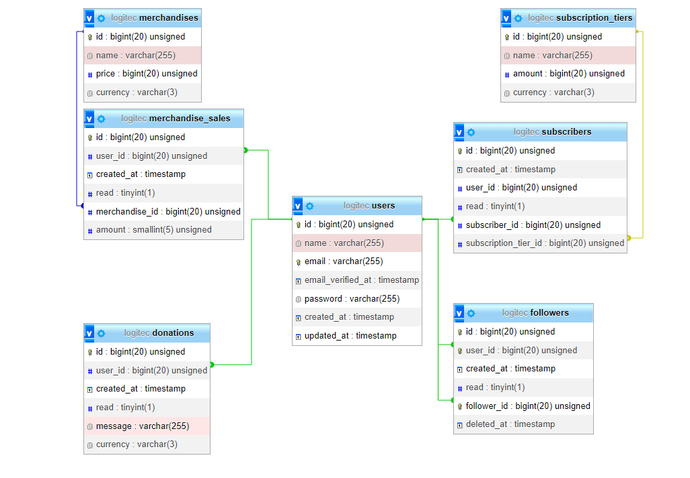

# Streaming Events Exercise

## Requiremenets

You will build an application called **Stream Events**. This application is aimed at showing streamers a list of events during their stream. 

### Registration

Users should be able to create an account through your preferred Oauth login system.

### Assignment Requirements

Create the following tables:
- `followers` (`name`)
- `subscribers` (`name` + `subscription tier` 1/2/3)
- `donations` (`amount` + `currency` + `donation message`)
- `merch_sales` (`item name` + `amount` + `price`)

Seed each table with about 300-500 rows of data for each user with creation dates ranging from 3 months ago till now.

Each of these rows should be able to be marked as `read`/`unread` by the user.

Aggregate the data from the above three tables:
- Show it to the user once they log in.
- Use a single list to display this information, format it as a sentence.
  - RandomUser1 followed you!
  - RandomUser2 (Tier1) subscribed to you!
  - RandomUser3 donated 50 USD to you! “Thank you for being awesome”
  - RandomUser4 bought some fancy pants from you for 30 USD!
- Only show the first 100 events.
- Load more as they scroll down.

Above the list show three squares with the following information
- Total revenue they made in the past 30 days from Donations, Subscriptions & Merch sales
  - Subscriptions are Tier 1: 5$ , Tier 2: 10$, Tier 3: 15$
- The total amount of followers they have gained in the past 30 days
- Top 3 items that did the best sales-wise in the past 30 days

## Extra Notes

Make use of best practices as if you were working on a large-scale project.

## Frontend

Build a simple SPA using JS & CSS, this does not have to look pretty. The main focus of this is the Backend implementation. Be sure to use REST API calls from the frontend side to call the backend.

## Deliverables

Do not spend more than 4 hours on the project, these 4 hours do not include the time it takes you to set up your dev environment.

You can submit a partial project if it’s not completed by the end of the 4-hour period.

---

## System requirements

-   PHP 8.1
-   MySQL database server
-   Composer

[Donwload XAMPP for windows](https://sourceforge.net/projects/xampp/files/XAMPP%20Windows/8.1.12/)
[Download Composer](https://getcomposer.org/download/)

## Deployment steps

```bash
git clone https://github.com/medilies/streaming-events-exercise
```

```bash
cd streaming-events-exercise
```

```bash
composer install
```

```bash
npm i
```

```bash
npm run build
```

Create a database

```bash
cp .env.example .env
```

Set `DB_DATABASE` `DB_USERNAME` `DB_PASSWORD`

```bash
php artisan key:generate
```

```bash
php artisan optimize:clear
```

```bash
php artisan migrate:fresh --seed
```

Set GitHub Oauth provider and `GITHUB_CLIENT_ID`, `GITHUB_CLIENT_SECRET`

## APIs docs

Run:

```bash
php artisan scribe:generate
```

Open `api-docs\index.html` in a browser.

## DB



[diff](https://github.com/medilies/streaming-events-exercise/compare/13d4d9c25c87854631fab9face968487564c3570...57cf988a20abb83675f01dfa88cf2105bd8a3185)
